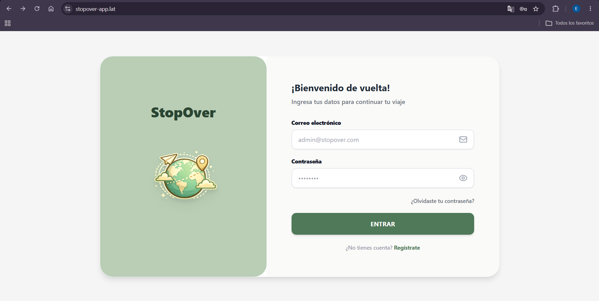
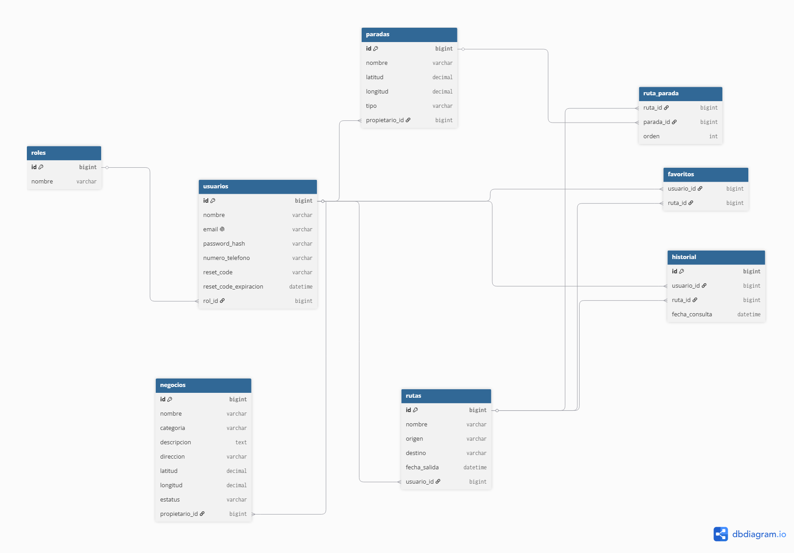
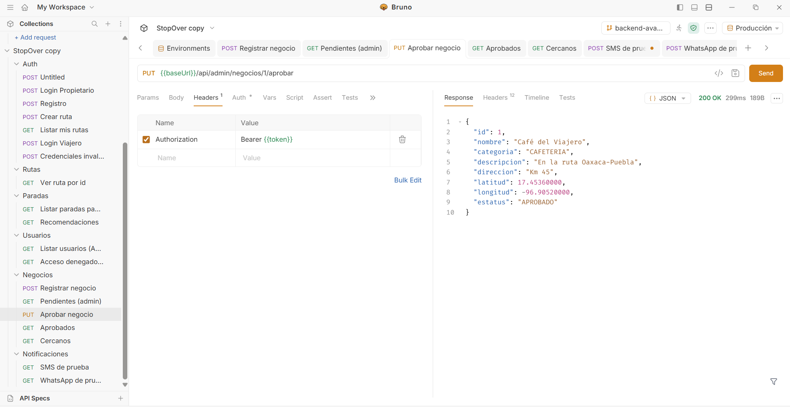
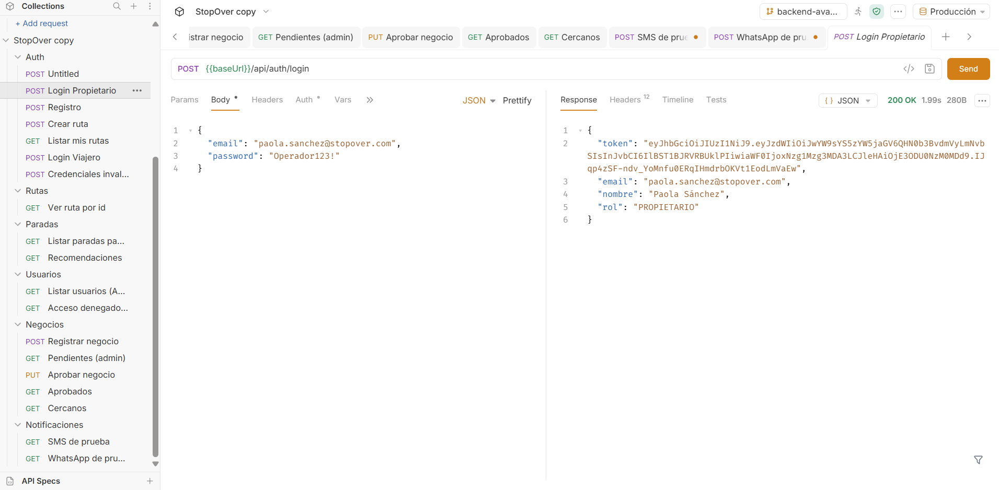
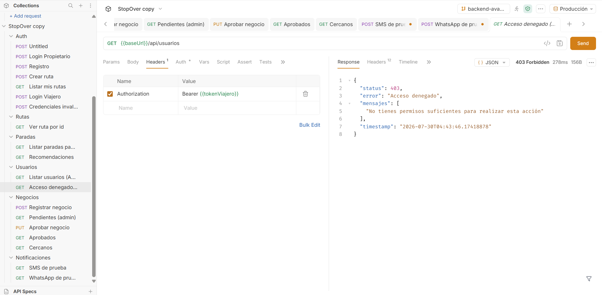

# StopOver-App

**Nombre del proyecto:** StopOver

Aplicación web full stack para planear viajes por carretera: el usuario define un origen y destino, y la app sugiere paradas (cafeterías, miradores, gasolineras, restaurantes) a lo largo de la ruta, según sus preferencias.

**Integrantes:**
1. Oscar Zuriel García Ortega
2. Emmanuel Abisai Ambrocio Garcia

**Problemática que resuelve:** 
Los viajeros de rutas largas a menudo desconocen los mejores lugares seguros y atractivos para hacer escalas (cafeterías, miradores, pueblos mágicos), ocasionando fatiga y pérdida de oportunidades turísticas. Al mismo tiempo, los negocios locales en estas carreteras carecen de visibilidad directa ante los conductores. StopOver permite gestionar y visualizar puntos de escala óptimos, conectando las rutas de los viajeros con los establecimientos locales.


## Tecnologías utilizadas

- **Backend:** Java 21, Spring Boot, Spring Security + JWT, Spring Data JPA, Hibernate
- **Base de datos:** MySQL 8.4, Flyway (migraciones versionadas)
- **Frontend:** React + Vite
- **Comunicación:** Postfix + JavaMailSender (correo), Twilio (SMS y WhatsApp)
- **Infraestructura:** VPS (AWS EC2), Nginx (reverse proxy), Let's Encrypt / Certbot (HTTPS)
- **Pruebas de API:** Bruno
- **Control de versiones:** Git / GitHub, GitHub Projects

## Enlaces del proyecto

- **Sitio desplegado (HTTPS):** https://stopover-app.lat
- **URL base de la API:** https://stopover-app.lat/api
- **Prototipo de Figma:**https://www.figma.com/design/fE1X6nT8VaJHfgHgFsRWyC/StopOver---Mockup?node-id=0-1&t=MutAk7gtp9dQd4l5-0
- **Tablero de GitHub Projects:** https://github.com/users/OscarZurielGarciaOrtega/projects/6/views/1



---

# Backend

## Diagrama Entidad-Relación



Resumen de tablas principales:

- **roles** — ADMIN, VIAJERO, PROPIETARIO
- **usuarios** — datos de cuenta, relacionados a un rol
- **rutas** — viajes creados por un usuario (origen, destino, fecha)
- **paradas** — puntos de interés (cafeterías, miradores, gasolineras, restaurantes)
- **ruta_parada** — tabla intermedia de la relación N:M entre rutas y paradas
- **favoritos** — rutas marcadas como favoritas por un usuario
- **historial** — registro de consultas de rutas por usuario
- **negocios** — comercios registrados por propietarios, con flujo de moderación (PENDIENTE / APROBADO / RECHAZADO)

## Credenciales de prueba

| Rol | Email | Contraseña |
|---|---|---|
| Administrador (evaluación) | admin@stopover.com | Admin123! |
| Viajero | ana.garcia@stopover.com | Usuario123! |
| Propietario | paola.sanchez@stopover.com | Propietario123! |

## Instalación y ejecución local del backend

### Requisitos previos
- Java 21
- Maven (incluido vía `mvnw`)
- MySQL 8.x 

### Pasos

1. Clona el repositorio:
```bash
   git clone https://github.com/OscarZurielGarciaOrtega/StopOver-App.git
   cd StopOver-App/backend
```

2. Copia el archivo de configuración de ejemplo y complétalo con tus propios valores:
```bash
   cp src/main/resources/application.properties.example src/main/resources/application.properties
```

3. Edita `application.properties` con los datos reales de tu base de datos, tu clave JWT, y tus credenciales de Twilio.

4. Crea la base de datos en MySQL:
```sql
   CREATE DATABASE stopover_db CHARACTER SET utf8mb4;
```

5. Ejecuta la aplicación (Flyway aplica automáticamente todas las migraciones y siembra los datos de prueba):
```bash
   ./mvnw spring-boot:run
```

6. El backend queda disponible en `http://localhost:8080`.

## Documentación de la API — endpoints principales

URL base: `https://stopover-app.lat/api` (o `http://localhost:8080/api` en local)

### Autenticación (públicos)
- `POST /api/auth/login` → `{ email, password }`
- `POST /api/auth/registro` → `{ nombre, email, telefono, password }`
- `POST /api/auth/recuperar-password` → `{ email }` (envía código por SMS)
- `POST /api/auth/reset-password` → `{ email, codigo, nuevaPassword }`

Todas las respuestas de login/registro incluyen un token JWT que debe enviarse en cada petición protegida:

### Rutas (requieren autenticación)
- `POST /api/rutas` → crea una ruta con sus paradas (`paradaIds: [1,2,3]`)
- `GET /api/rutas?page=0&size=10` → rutas del usuario autenticado, paginado
- `GET /api/rutas/{id}` → detalle de una ruta con sus paradas
- `PUT /api/rutas/{id}` → actualiza una ruta
- `DELETE /api/rutas/{id}` → elimina una ruta

### Paradas (requieren autenticación)
- `GET /api/paradas?page=0&size=10&tipo=CAFETERIA` → listado paginado con filtro opcional
- `GET /api/paradas/recomendaciones?tipo=CAFETERIA&destino=oaxaca` → recomendación combinada

### Usuarios (requiere rol ADMIN)
- `GET /api/usuarios` → listado paginado de usuarios

### Negocios (moderación)
- `POST /api/negocios/registrar` (rol PROPIETARIO) → registra un negocio (queda en estatus PENDIENTE)
- `GET /api/admin/negocios/pendientes` (rol ADMIN)
- `PUT /api/admin/negocios/{id}/aprobar` (rol ADMIN)
- `PUT /api/admin/negocios/{id}/rechazar` (rol ADMIN)
- `GET /api/negocios/aprobados` → negocios visibles en el mapa
- `GET /api/negocios/cercanos?lat=X&lng=Y&radioKm=10&categoria=CAFETERIA` → búsqueda por cercanía real (fórmula de Haversine)
- `POST /api/negocios/{negocioId}/agregar-a-ruta/{rutaId}` → convierte un negocio aprobado en parada de una ruta

### Notificaciones
- `POST /api/notificaciones/sms-prueba?numero=+52...`
- `POST /api/notificaciones/whatsapp-prueba?numero=+52...`

### Formato estándar de errores

Todas las respuestas de error siguen esta estructura, con el código HTTP correspondiente (400, 401, 403, 404, 500):
```json
{
  "status": 400,
  "error": "Datos inválidos",
  "mensajes": ["mensaje específico 1", "mensaje específico 2"],
  "timestamp": "2026-07-29T12:00:00"
}
```

## Pruebas de API con Bruno

La colección de Bruno está versionada en la carpeta [`/bruno`](./bruno) de este repositorio, e incluye:
- Login y obtención del token JWT
- Uso del token en peticiones protegidas (rutas, paradas, usuarios, negocios)
- Casos de error (credenciales inválidas, acceso denegado por rol, recurso no encontrado)





## Despliegue en VPS

- Backend ejecutado como `.jar` en el VPS
- Nginx como reverse proxy hacia el backend (puerto 9000 interno)
- Certificado SSL gratuito con Let's Encrypt / Certbot sobre el dominio `stopover-app.lat`
- Correo saliente configurado con Postfix (SPF y DKIM publicados en el DNS del dominio)

---

# Frontend

<!-- Aquí Oscar agrega: instrucciones de instalación del frontend, capturas de las pantallas principales, y cualquier detalle específico de su parte -->